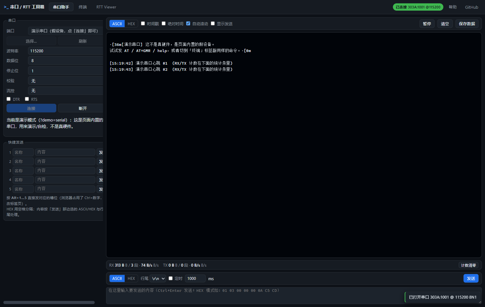
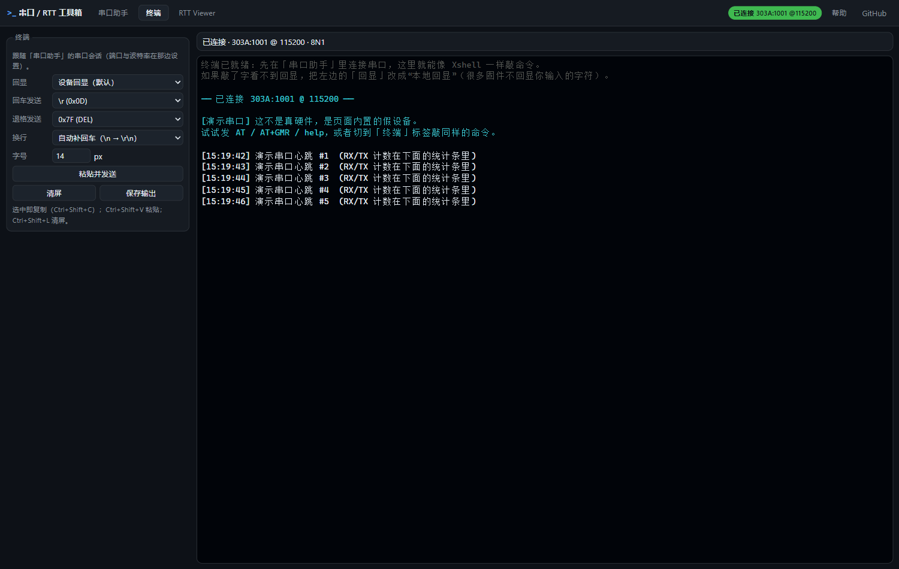
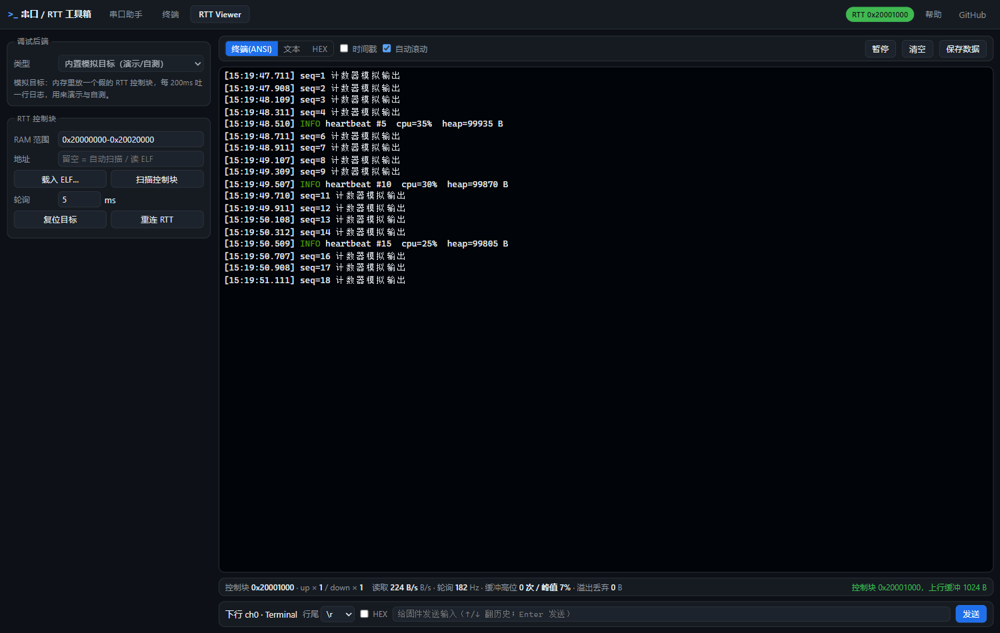
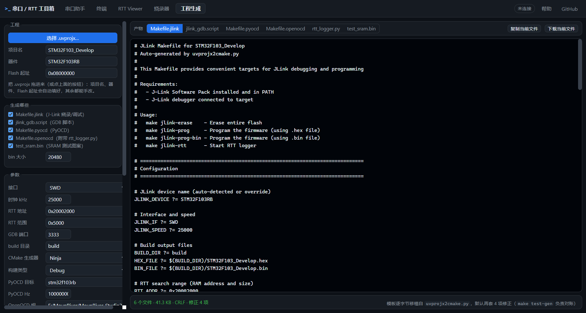
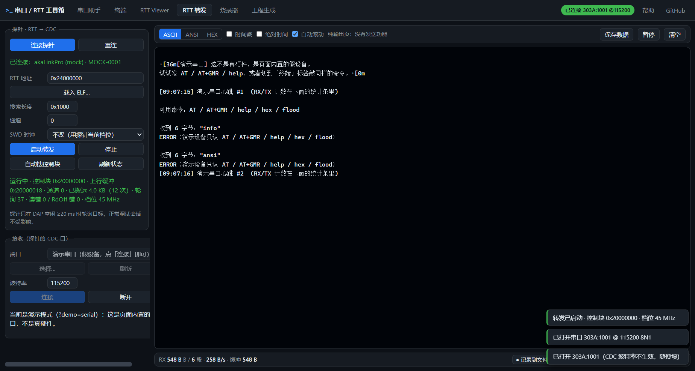
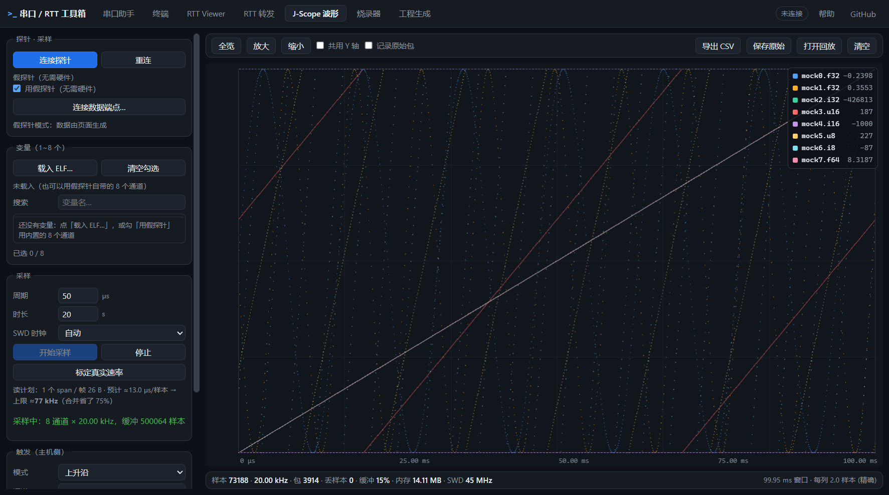
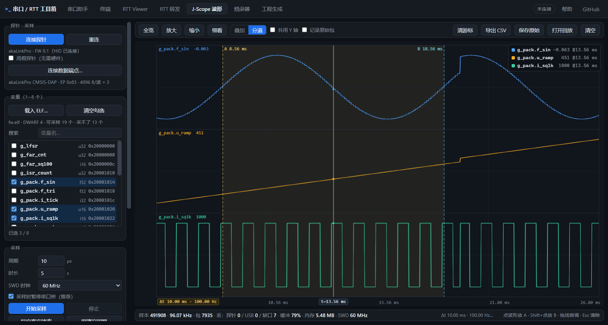

# 串口 / RTT 工具箱（网页版）

零安装的调试小工具，纯静态页面，直接托管在 GitHub Pages：

**👉 [在浏览器里直接打开](https://minichao9901.github.io/web-serial-rtt-tools/)**
（桌面版 Chrome / Edge；无需安装任何东西，串口/探针在页面里授权一次即可）

| 标签页 | 干什么 | 需要什么 |
|---|---|---|
| **串口助手** | SSCOM 那套核心功能：端口/波特率、ASCII/HEX 收发、**ANSI 彩色接收**（像 MobaXterm）、时间戳、定时发送、5 条快捷发送、保存接收数据、**记录到文件**（高速采集不丢数）、**高速自动关显示**（>50KB/s 停渲染、数据照收） | 桌面版 Chrome / Edge（Web Serial） |
| **终端** | Xshell 式串口终端：xterm.js 渲染 ANSI、本地回显、回车/退格映射、粘贴发送；侧栏还能开 **akaLinkPro 的 RTT→CDC 转发**（探针自己读 RTT 塞进 CDC，主机只读一个 COM 口） | 同上（与串口助手共用同一个串口会话）；转发功能需要 akaLinkPro 探针 |
| **RTT Viewer** | SEGGER RTT 多通道查看 + 下行输入 + 复位目标，四种后端；**目标类型可选 SWD/ARM 或 RISC-V/JTAG**（HPM 等，零安装走 JTAG+DMI+SBA）；同样支持记录到文件与高速自动关显示 | **零安装**：WebUSB + CMSIS-DAP 探针<br>**可选**：本地桥 + OpenOCD / J-Link |
| **RTT 转发** | akaLinkPro 的**探针侧** RTT→CDC：探针自己通过 SWD 轮询目标控制块、把数据塞进它的 CDC 串口；本页开那个 COM 口收数据。**纯输出，没有发送**：ASCII/ANSI/HEX、时间戳、暂停、保存数据、记录到文件、高速自动关显示 | akaLinkPro 探针（配置走它的自定义 HID；接收走它的 CDC 口） |
| **J-Scope 波形** | 类 SEGGER J-Scope 的**变量示波器**：探针自己按固定周期读目标 RAM（HSS，目标固件不用改），数据走 WebUSB 的独立批量端点，网页画多通道波形、带**触发**、导出 CSV、原始包可回放 | **网页侧已可用**：勾「用假探针」或打开 `.jsp` 回放即可体验；真机需要探针固件支持 `HID 0x32`（见 [`docs/scope-page.md`](docs/scope-page.md)） |
| **烧录器** | .elf/.hex/.bin 写进目标：**零安装 WebUSB**（页面跑 flashloader，擦/写/校验/复位一条龙）或**本地桥 OpenOCD** | 零安装：同上探针；桥：OpenOCD |
| **工程生成** | 拖进 Keil `.uvprojx` 就能生成调试/下载配套文件：`Makefile.jlink`、`jlink_gdb.script`、`Makefile.pyocd`、`Makefile.openocd`（连带 `rtt_logger.py`）、`test_sram.bin`；参数可填可勾，产物**实时预览** | 不需要任何硬件/后端（纯前端生成） |

> 为什么 RTT 要分三种后端：J-Link 与 OpenOCD 都是**本机程序**，网页无权启动进程、也无权开 TCP。
> 所以零安装模式下 RTT 走 **WebUSB 直连 CMSIS-DAP 探针**；想用 J-Link/OpenOCD 就启动仓库里的桥（`bridge/`）。

## 界面

| 串口助手 | 终端 |
|---|---|
|  |  |

| RTT Viewer（内置模拟目标） | 工程生成 |
|---|---|
|  |  |

| RTT 转发（探针侧 RTT→CDC；截图里是内置假探针 + 演示串口） |
|---|
|  |

| J-Scope 波形（假探针 · 8 通道 · 20 kHz · 带触发标记） |
|---|
|  |

| J-Scope 波形（**真机** · akaLinkPro 探针 HSS · 分道显示：正弦/锯齿/方波各一条泳道 · 100.00 kHz · 丢样本 0 · 标尺停在 13.56 ms，A/B 量出一个完整周期 Δt 10.00 ms → 100.00 Hz） |
|---|
|  |

（截图里第一个标签用的是**内置演示串口**，所以显示的是假设备；`?demo=serial` 就能自己试。）

## 实测状态（2026-09-26，真硬件：MicroLink CMSIS-DAP + STM32F103）

| 用例集 | 结果 |
|---|---|
| Node 协议层（控制块定位/环形绕回/丢包信号/下行写入/ELF 符号/HEX） | **34/34** |
| 桥端到端（真板，上行 ch0+ch1、下行命令、flood、复位） | **19/19** |
| 浏览器无硬件（演示串口的整条 UI 链路） | **15/15** |
| 浏览器 + 真探针（WebUSB 零安装 RTT：定位/上行/下行/复位） | **11/11** |
| 浏览器 + 桥（OpenOCD 后端：定位/上行/下行） | **5/5** |
| 串口助手真板（DAPLink CDC 桥到 PA9/PA10，`help/info/ansi/hex` 回包） | ✅ |

速度实测（同一探针同一条 SWD）：**WebUSB 单命令往返 0.34 ms、连续读 127 KB/s**；
**OpenOCD Tcl RPC 只有 ~17 KB/s** —— 大流量 RTT 优先用 WebUSB。详见 [`docs/backends.md`](docs/backends.md)。

## 真机场景验收（2026-10：STM32F103ZE + akaLinkPro，一条命令全跑完）

"全流程能不能用"这件事现在有**可重复的自动化验收**了（跑一遍约 2 分钟，带判决，出错立刻停）：

```powershell
make hw-campaign                          # 2 轮全场景 + 狂发↔scope 交替烧录 5 遍
make hw-campaign ARGS="--cycles=1 --alt=1"    # 冒烟
make hw-campaign ARGS="--keep-going"          # 出错也跑完（长稳观察用）
```

它按固定口径跑四步并**当场判决**（脚本头写着完整口径）：

| 步骤 | 判决 |
|---|---|
| ① 烧狂发固件 → 测 RTT Viewer | **> 300 KB/s** |
| 　 同一条链 → 测 RTT 转发（60 MHz 档） | **> 2.5 MB/s** |
| 　 转发 **10 s 存盘**（页面「记录到文件」） | 文件字节 = 同窗口收数（<2%）· 内容可读 · 无积压 |
| ② 烧 scope 固件 → J-Scope 1 变量 / 3 变量（@2 µs 与 @20 µs） | 跑通；50 kHz 档**零丢样本** |
| ③ ①②重复 2 遍　④ 狂发↔scope 交替烧录 5 遍 | 逐次计时 |

**2026-10 基线（判决 20 通过 / 0 失败，原样可复现）**

| 项目 | 实测 |
|---|---|
| 烧录 狂发（ZE 版 1.0 KB）/ scope（3.3 KB） | **0.73 s / 1.04 s**（交替 5 遍：0.7×5、1.0×5） |
| RTT Viewer | **616 / 609 KB/s**（60 MHz 档） |
| RTT 转发 | **2.90 / 2.90 MB/s**（探针侧自报 2.60 / 2.55） |
| 转发 10.2 s 存盘 | **29.4 MB**，逐字节核对误差 0.2%，积压 ~200 KB |
| J-Scope 1 变量 @2 µs | 436~441 kHz（1 span / 4 B） |
| J-Scope 3 变量 @2 µs | 109 kHz（1 span / 10 B） |
| J-Scope @20 µs（50 kHz 档） | 50.00 kHz，**探针丢 0 / USB 丢 0** |

完整数据与读法见 [`docs/真机基准测试.md`](docs/真机基准测试.md)。跑之前要知道的三件事：

1. **狂发固件要用 ZE 版**：`pwsh -File tools/target-firmware/stm32f103_rtt_speed/build.ps1 -Board ze`
   → `build-ze/fw.elf`（96 MHz + RTT 32 KB 缓冲）。仓库里曾长期躺着一份**旧简化版**
   （没有 PLL 设置、`SYST_RVR=8000`、缓冲 4 KB）—— 用它测转发只有 **0.45 MB/s**，
   会被误判成"探针慢/工具坏了"，其实是目标喂不满。
2. **串口授权只能人工点一次**（Web Serial 的浏览器规定）；之后用
   `node tools/selftest/serial-grant.mjs` 可以把授权搬进测试 profile / 补"当前这个 USB 口"的实例 ID。
3. 跑之前**别让别的浏览器/工具占着探针**（你自己那个浏览器里的 RTT Viewer、J-Scope 数据端点都算）。

## 真机场景验收 · HPM6800EVK（RISC-V/JTAG，2026-10）

同一套口径搬到 RISC-V 板子上 —— **RTT Viewer 现在也有 RISC-V 通路了**（零安装，走
HID 切 SWD+JTAG → WebUSB 的 `DAP_JTAG_Sequence` → RISC-V DMI → SBA 系统总线读内存）：

```powershell
make hw-campaign-hpm                          # 2 轮全场景 + flood↔scope 交替烧录 5 遍（约 5 分钟）
make hw-campaign-hpm ARGS=--record            # 只记录不判决，末尾打印"实测 × 80%"的 spec 建议
make hw-campaign-hpm ARGS="--cycles=1 --alt=1"   # 冒烟
```

| 步骤 | 判决（spec = 首跑实测 × 80%） |
|---|---|
| ① 烧 flood 固件（RTT 在**非缓存 AXI SRAM**） | ≤ 11.3 s |
| 　 RTT Viewer（RISC-V 通路，控制块地址从 ELF 的 `_SEGGER_RTT` 取） | **> 56.5 KB/s** · 零错位读 |
| 　 RTT 转发（探针侧桥 → CDC） | **> 1.10 MB/s** |
| 　 转发 **10 s 存盘** | 文件字节 = 同窗口收数（≥98%）· 内容可读 · 无积压 |
| ② 烧 scope 固件 → J-Scope 1 变量 / 3 变量（采**非缓存** `g_v` 成员） | ≥ 206.6 kHz / ≥ 32.6 kHz |
| 　 @20 µs（50 kHz 档） | **探针丢 0 / USB 丢 0** |
| ③ ①②重复 2 遍　④ 交替烧录 5 遍 | 逐次计时（实测均 8.4 s / 8.4 s） |

**2026-10 基线（实测均值；`make hw-campaign-hpm` 原样可复现）**

| 项目 | 实测 |
|---|---|
| 烧录 flood（45.6 KB）/ scope（45.1 KB，JTAG + 校验） | **9.5 s / 8.5 s**（交替 5 遍各 8.4 s 上下） |
| RTT Viewer（RISC-V/JTAG，SBA 读法） | **70.6 KB/s**（轮询 2.7 Hz，零错位读） |
| RTT 转发 | **1.377 MB/s**（探针侧自报 1.20~1.23） |
| 转发 10.2 s 存盘 | **13.95 MB**，一致性 99.6~99.7%，积压 48~68 KB |
| J-Scope 1 变量 @2 µs | 257~259 kHz（1 span / 4 B） |
| J-Scope 3 变量 @2 µs | 40.8 kHz（1 span / 12 B） |
| J-Scope @20 µs（50 kHz 档） | 1 变量 50.00 kHz · **探针丢 0 / USB 丢 0**（缺口固定 6，是起跑边界） |

跟 F103 那份的差别（也是不能拿 F103 的线来卡 HPM 的原因）：

- **RTT Viewer 慢一个量级**（70 KB/s vs 616 KB/s）：RISC-V 走 SBA，一次读要"每字两次 DMI 扫描"，
  瓶颈是**每条 CMSIS-DAP 命令的 USB 往返**（实测 TCK 1 MHz 与 60 MHz 一样快）。已按"一条命令塞多拍"
  优化（512 个字从 ~1024 条命令降到 69 条，真机 6.3 → 59 KB/s），仍远低于探针固件自己搬的那条路。
- **烧录慢十几倍**（9.5 s vs 0.73 s）：HPM 是 XPI flash + JTAG，页面要跑 ROM API 算法，
  每写一批都过 DMI/SBA；离线校验读回的那 45 KB 现在也走批量读。
- **控制块地址要自己给**：HPM 的结构体在 AXI SRAM（本机固件 `_SEGGER_RTT = 0x01240000`），
  从 `0x20000000` 起自动搜是搜不到的 —— 页面「载入 ELF…」或基准脚本从 ELF 符号表取。
- **必须是非缓存内存**：探针的 SBA 读**不旁路 D-Cache**，放可缓存区会读到陈旧值
  （scope 固件故意放了 `g_v` / `g_v_cached` 两份做对照）。

完整数据、读法与三条踩坑见 [`docs/真机基准测试-hpm.md`](docs/真机基准测试-hpm.md)。

## 快速开始

1. 打开页面（Pages 地址或本机的 `http://127.0.0.1:17321/`）。
2. **串口**：点「选择…」在浏览器弹框里选一次 COM 口（浏览器规定必须手动选一次），然后「连接」。
3. **RTT（零安装）**：RTT Viewer → 后端选 `WebUSB · CMSIS-DAP` → 「连接探针」→ 它会自动扫描 RAM 找到 `SEGGER RTT` 控制块（换芯片先在「RTT 控制块 → 芯片」选系列，RAM 范围自动带出；也可以先「载入 ELF…」用符号直接定位，更快）。
4. **RTT（J-Link / OpenOCD）**：双击 `bridge/start-bridge.bat`，页面里后端选「本地桥 · OpenOCD」→ 选目标芯片（常用 STM32 系列已内置；其它芯片选「自定义 cfg…」填 cfg 文件）→ 连接。

串口和 RTT 可以**同时**用（一个走 USB CDC、一个走探针）。

## 工程生成（.uvprojx → 调试配套文件）

第 5 个标签页。把 Keil 工程文件拖进去（`<Device>` / `<Cpu>` 里的 Flash、RAM 会被读出来自动填），
勾一勾、改几个参数，就能拿到 5 类配套文件：模板是**逐字节移植**自 `uvprojx2cmake.py`（另一个 Python 工具）的，
页面再**固定套 4 项修正**（见下），所以默认产物 = Python 产物 + 这 4 处修补；
把修正整个关掉（代码里传 `fixes: null`，对账自测走的就是这条路）即与 Python 工具**逐字节一致**。

| 勾选 | 产物 | 用途 |
|---|---|---|
| J-Link Makefile | `Makefile.jlink` | `make -f Makefile.jlink jlink-prog / jlink-rtt / jlink-gdb / jlink-debug` |
| GDB 脚本 | `jlink_gdb.script` | 连 `JLinkGDBServerCL` 的 3333 端口、`load`、`break main`；OpenOCD/PyOCD 的 Makefile 也复用它 |
| PyOCD Makefile | `Makefile.pyocd` | `pyocd erase/flash/gdbserver/rtt` |
| OpenOCD Makefile | `Makefile.openocd` **+ `rtt_logger.py`** | 擦/烧/校验、`openocd-rtt`（RTT server + 那份 socket 日志脚本）、`openocd-sram` |
| SRAM test bin | `test_sram.bin` | 20KB 的 `0x00 01 02 … FF` 递增图案，给 `openocd-sram` 灌进 RAM 再回读比对（**不是可执行代码**） |

文件怎么落地：

- **Edge / Chrome**：「写入文件夹…」选一次目录，多个文件**直接写进去**（不打包、不解压；同名文件会先问你，和 Python 工具"存在就不覆盖"一个意思）；
- **其它浏览器**：自动退化成「打包 ZIP」落「下载」文件夹；
- 预览区还能单独下载 / 复制当前那个文件。

网页**不能**静默写你的项目目录 —— 必须你亲手选一次文件夹（浏览器安全模型）。

**固定套用的 4 项修正**（2026-09-27 逐条过审；改的是 Python 模板里用起来硌人的地方）：

| # | 修正 | 原来会怎样 |
|---|---|---|
| 1 | `Makefile.jlink` 的 `RTT_SIZE` `0x5000 → 0x2000` | 在 20KB RAM 的 F103 上 `0x20002000+0x5000` 越过 RAM 顶 |
| 2 | `clean-jlink` 不再删 `*.log` | 会把 J-Link 自己写的 `JLinkLog.txt` 一起删掉 |
| 3 | `openocd-rtt` 改用双引号 `-c "…"`（内层 `\"SEGGER RTT\"`） | 原来 `-c '…'` 在 cmd.exe 里单引号不是引号 → 直接报错 |
| 4 | 去掉 `jlink-swo` 目标 | 硬编码 72MHz 只对 F103 成立，且固件没开 PB3/TRACESWO，跑出来是空日志 |

修正都是**逐行定点替换**，匹配不到就抛错（绝不静默产出半成品）；你自己在页面上填过的值优先，
例如 RTT 范围填了 `0x1000` 就不会被改回 `0x2000`。

三点与 Python 工具**故意不同**（更顺手，也更忠实于工程文件本身）：

1. **项目名**：Python 工具取 `.uvprojx` 所在**目录名**；网页在拖入文件夹/相对路径时同样取目录名，否则退回 `<TargetName>`（再不然用文件名），反正这个框可以手改。
2. **换行符**：默认 **CRLF**（与 Python 产物逐字节一致）；想给 git 用切成 LF 即可，除换行外内容完全相同。

细节与对账方法见 [`docs/gen-page.md`](docs/gen-page.md)。

## RTT → CDC 转发（akaLinkPro 探针侧桥）

独立一页（**RTT 转发**，排在 RTT Viewer 后面）：让**探针自己**通过 SWD 轮询目标的 RTT 控制块、
把数据塞进它的 CDC 虚拟串口 —— 主机只要读一个 COM 口，不用每轮三次 USB 往返。本机实测
（akaLinkPro + STM32F103 洪水固件）：**2468 KB/s**，而且满速转发时 HID 控制通道照样 260 ms 一次应答。

这一页按「串口助手」的接收半边做，**砍掉了所有发送**（这是纯输出：数据是探针从目标搬过来的）：
端口选择/连接、ASCII / ANSI / HEX 显示、时间戳、暂停、清空、自动滚动、**保存数据**、
**记录到文件**（高速采集不丢数）、高速自动关显示。

用法：RTT 转发页 →「连接探针」（HID，授权一次后页面会自动重连）→ RTT 地址手填或「载入 ELF…」
自动解析 `_SEGGER_RTT` →「启动转发」→ 在**同一页**点「选择…」授权探针的 CDC 口并「连接」，
数据就出来了。「停止」把 CDC 交回 UART。

⚠️ Cortex-M7（H743 / H7B3…）的 DTCM 探针读不到，地址要给 AXI SRAM（如 `0x24000000`）。

协议、返回码（含 `-100` = "排队中"这个坑）、实测数字与踩坑记录都在 [`docs/rtt-cdc.md`](docs/rtt-cdc.md)。
自测：`make test-hid`（协议层，不需要硬件）+ `make test-ui`（页面里假探针 + 演示串口走一遍）。

## J-Scope 波形（变量示波器）

探针侧 HSS 采样：探针自己按你设的周期去读目标 RAM 里那几个变量（**目标固件一行都不用改**），
主机只负责收包、解码、画图。8 个变量正好装进一条 HID 配置报文，数据走 interface 0 上
**原本闲置的 bulk IN 端点 `0x83`**（零描述符改动、不用装驱动）。

页面里现在就能玩的（**不需要硬件**）：
1. 勾「**用假探针（无需硬件）**」→「开始采样」→ 立刻出波形（8 个通道，f32/i32/u16/i16/u8/i8/f64 各一）；
2. 「载入 ELF…」→ 从 DWARF 里选变量（**全局/静态变量 + 结构体成员**，带类型；采不了的会写明原因）；
3. 触发：选通道/阈值/预触发 → 实时命中，或「**查找下一个**」在已采到的数据里重新定位（不用重采）；
4. 导出 CSV、勾「记录原始包」存 `.jsp`、再用「打开回放」离线看波形。

速率的关键不是 USB 而是 **SWD 读**：变量排在一起（同一个结构体）能比散落快 3~4 倍 ——
页面上「读计划」那行会直接告诉你当前选择的 span 数与预计上限。
原理、协议、速率模型、踩坑记录都在 [`docs/scope-page.md`](docs/scope-page.md)。

自测：`make test-scope`（引擎层 124 项，含 8 通道 × 10000 样本逐点对账）+
`make test-dwarf`（ELF/DWARF 65 项）+ `make test-scope-page`（真页面 CDP 88 项）。

**目标类型（SWD/ARM ↔ RISC-V/JTAG）**：探针的目标类型是**全局且粘性**的（HID `0x31` action 10），
波形页和 RTT 转发页都能切。页面显示的是**探针回报的生效后端**（DEF 的 `flags bit6` / 状态字 0 的 `bit1`），
不是"你下发的那个" —— 后端拉不起来时探针会自己换一条路重试，所以要以生效值为准。
切到 RISC-V 后：SWD 时钟档自动置灰（JTAG 忽略它）、计划行的速率提示换成实测分档
（单变量 ≈2.94 µs / 8 通道 ≈45.6 µs，零丢建议周期 ≥1.5×）、标定里的 blob/clock_delay 不再显示。
依据：akaLinkPro 的 [`web-handoff-riscv-scope.md`](https://github.com/minichao9901/akaLinkPro)。

真机还差探针固件那一步：补丁草稿在 [`tools/probe-firmware/`](tools/probe-firmware/) ——
`scope_sampler.c/.h`（采样器本体）+ `patch-notes.md`（6 处集成改动，逐段可粘贴）+ 验收清单
（M0 标定 → 用仓库里的 F103 靶子固件逐项对账 → 撕裂率/混叠的量化检查）。

### 真机实测（2026-09-29，探针固件已实现 HSS）

| 配置 | 探针侧标定 @60 MHz | 本页端到端实测 | 丢样本 |
|---|---|---|---|
| **单变量 u32**（3 µs 周期） | 1.54 µs/样本 → **649 kHz** | **333 kHz** | 探针 0 · USB 0 · 缺口 6 / 1.11 M |
| **8 通道**（`g_pack`，1 个 24 B span，12 µs） | 11.14 µs → **90 kHz** | **68.9~72.4 kHz** | 探针 0 · USB 0 · 缺口 7 / 240.9 k |

契约核对全过（`i_sq1k ∈ {±1000}`、`u_hi` 高位 = 1、`f_sin ∈ [-1,1]`、`g_tick` 步进 0/1 零异常），
与探针仓库自己的命令行工具（1.605 µs / 622.9 kHz）同量级。
> 单变量能到几百 kHz 是因为固件把"单字 span"优化成了**每拍 1 次传输**（抱 TAR + 流水读）；
> 多通道才是"字数决定天花板"（6 字 span 光传输就 90 kHz 到顶）。

**只有真机才暴露的三个坑**（都已修）：WebUSB 报的 `endpointNumber` **不含方向位**（0x83 读出来是 3）；
必须先开数据面读**再**发启动（否则最先那个 DEF 包早被丢掉，起跑线永远等不到）；
上一轮的残留包会污染新一轮（用每轮开头的 DEF 当起跑线，之前的一律丢弃并计数）。

## 支持的调试后端

| 后端 | 通道 | 双向 | 目标控制 | 依赖 |
|---|---|---|---|---|
| **WebUSB · CMSIS-DAP v2** | 全部（页面读 ch0） | ✅ | 复位（nRESET 脉冲，复位后让它继续运行） | 只认 CMSIS-DAP 类探针（DAPLink / MicroLink / 自制 cherrydap…） |
| **本地桥 · OpenOCD** | 全部 | ✅ | halt/go/reset | 本机装 OpenOCD（ESP-IDF 自带那份即可） |
| **本地桥 · J-Link** | ch0（telnet 19021）或 `JLinkRTTLogger` 落文件 | ch0 ✅ | — | SEGGER J-Link 软件 |
| **内置模拟目标** | 1 up / 1 down | ✅ | 复位 | 无（演示与自测用） |

`WebUSB` 不支持 J-Link 探针（协议不开放）；反过来 J-Link 后端也不需要 WebUSB。

## 零安装烧录

| 目标 | 后端 | 算法 | 进度 |
|---|---|---|---|
| **STM32** F0/F1/F4/F7/H7/L0/L4 | WebUSB · CMSIS-DAP | ARM flashloader（pyOCD 的算法块，见 `app/flash/algos.js`） | 真机打通（F103 实测逐字节一致） |
| **HPM 系列**（RISC-V）5300/5E00/6200/6300/6700/6800/6E00/6P00 | WebUSB · CMSIS-DAP **JTAG** | 自制 RV32 flashloader（HPM SDK 的 `openocd_algo`，1.4 KB，**一份通吃全系**） | ✅ **真机打通**（HPM6800EVK，45 KB 约 9 s，含校验；见 [`docs/真机基准测试-hpm.md`](docs/真机基准测试-hpm.md)） |

HPM 那条路的要点：探针切 SWD+JTAG 输出模式 → `DAP_Connect(JTAG)` → 用 `DAP_JTAG_Sequence`
驱动 RISC-V 的 DMI（IR=0x11）→ Debug Module + SBA 把 flashloader 写进 SRAM → 调它的
`flash_init/erase/program/read`（算法自己调芯片 ROM 里的 XPI NOR 驱动去擦写外部 flash）。
板级参数直接取自 HPM SDK 的 `boards/openocd/boards/*.cfg`。

为什么能"一份 blob 通吃 HPM 全系"：所有 HPM 系列的 ROM API 表地址都是 `0x2001FF00`，
差异只在运行时参数（`flash_base` / `xpi_base` / `option0/1`）。

自测：`make test-hpm`（60 项，**纯离线**：把真实代码跑在模拟 TAP+DTM+Debug Module+SBA+XPI flash 上，
包括"擦→写→校验"端到端与 NOR 的按位与语义）；重建算法：`make hpm-algo`。
设计、证据链、以及**真机 bring-up 的 6 步检查表**见 [`docs/hpm-riscv-flash.md`](docs/hpm-riscv-flash.md)。

## 目录

```
index.html              单页三标签（无构建步骤）
app/
  core/                 bus/store/hex/format/rxview/stats/bin/b64 —— 与界面无关的纯逻辑
  serial/               session(Web Serial 封装) / assistant / terminal / demo(演示串口)
  rtt/                  protocol(RTT 协议) / dap-webusb(CMSIS-DAP) / bridge / elf / mock / view
  gen/                  工程生成：templates(模板移植自 uvprojx2cmake.py) / fixes(固定 4 项修正) / model(参数+器件表+uvprojx 解析) / zip(零依赖打包) / view
  hid/                  akaLinkPro 自定义 HID：probe(协议 + WebHID 客户端) / mock(假探针) / view(桥的面板) / stream(RTT 转发页，纯输出接收)
  flash/                烧录器：image(固件解析) / algos+runner(ARM flashloader) / view
    hpm/                HPM 系列（RISC-V）：jtag(TAP/DMI 编码) / riscv-dm(DM+SBA) / dap-transport(WebUSB) /
                        flash(擦写流程) / chips(板级参数，来自 SDK cfg) / algo(自动生成的 blob) / entry(入口表解析)
  vendor/xterm/         xterm.js 本地副本（离线可用，MIT）
  ui/                   tabs / toast / dom 小工具
bridge/
  rtt-bridge.mjs        Node 单文件、零 npm 依赖：静态托管 + WebSocket + OpenOCD/J-Link 后端
  bridge.config.json    目标配置（stm32f103 / esp32s31 / …）
  start-bridge.bat|sh   双击启动
tools/
  selftest/             自测：Node 协议测试 / 工程生成对账 / HID 协议 / 页面端到端(CDP) / 桥端到端 / 浏览器真机(CDP) / LA 参考流量
    hw-campaign.mjs     **真机场景验收**（烧录+Viewer+转发+10s存盘+J-Scope+交替烧录计时，带判决，`make hw-campaign`）
    flash-timing.mjs    烧录耗时体检（`make flash-timing`，ARGS=--clamp 复现"后台页被限速"）
    recorder-file.test.mjs  「记录到文件」落盘语义（`.crswap`/积压/落盘进度，OPFS 替身；`make test-record`）
    serial-grant.mjs    Web Serial 授权的搬运/补当前口/清过期（CDP 管不了串口授权，只能这样自动化）
    com-read.py         独立的主机侧 COM 读者（转发测速/存盘用，os.read 大块读）
  fixtures/gen/         对账基线：Python 工具（uvprojx2cmake.py）对真实工程的原始产物，逐字节比对用
  fixtures/dwarf/       DWARF 解析基线：两份**真 ELF**（scope 靶子固件 + RTT 吞吐固件）
  la/                   逻辑分析仪：kingst_la.py（KingstVIS Socket API 单文件工具）+ SWD 流量发生器
  dev/                  extract-algo.py（从 pyOCD 抽 flash 算法，别手抄 base64）、help.ps1
  target-firmware/
    stm32f103/          STM32F103 测试固件（UART + RTT，含 SEGGER RTT 源码）
    stm32f103_rtt_speed/      F103 RTT 吞吐测试（死循环灌 hello world）；
                              **`-Board ze` 出 96 MHz + 32 KB 缓冲版**（本机板子用这份，见 README 的真机验收一节）
    stm32f103_scope/          **F103 J-Scope 靶子固件**：**96 MHz** 时基 + 契约已知的波形/变量，
                              `-Board ze|c8`（默认 ze）、check.py 客观验收（含 4 KB 地址空洞 → 两个 span 的读计划场景）；与探针仓库里那份逐字节同步
    stm32h7b0_rtt_speed/      **H7B0 RTT 吞吐测试**（HSI→PLL1 280MHz，DTCM 布局，见其 README）
    hpm6800evk_rtt_flood/     **HPM6800EVK（RISC-V）RTT 吞吐靶子**：96 MHz 死循环灌 hello world，
                              RTT 控制块放**非缓存 AXI SRAM**（`_SEGGER_RTT = 0x01240000`）
    hpm6800evk_scope/         **HPM6800EVK J-Scope 靶子**：契约变量块 `g_v`（非缓存）+ 对照 `g_v_cached`
docs/                   后端配置与排障；逻辑分析仪攻略.md（含 LA 工具完整源码与踩坑）；
                        scope-page.md（J-Scope 波形页方案）；真机基准测试.md（**F103 全场景基线与前置**）；
                        真机基准测试-hpm.md（**HPM6800EVK / RISC-V 基线与 RTT Viewer 的 RISC-V 通路**）；
                        rtt-cdc.md（RTT 转发 + 4.5 节「.crswap 与落盘时机」）
```

## 自测（不需要硬件也能跑一部分）

> 常用操作都收进 **`Makefile`** 了：`make` 看帮助，`make open` 一键盘起页面+浏览器，
> `make test` 纯逻辑自测，`make test-hw` 真机验收，`make fw-restore` 把测试固件烧回板子。
> 下面这些是等价的原始命令。

```powershell
# 1) 纯逻辑（RTT 协议 / ELF 符号 / HEX 解析）—— 不需要浏览器、不需要硬件
node tools\selftest\rtt.test.mjs

# 1b) 工程生成页对账：与 Python 工具 uvprojx2cmake.py 的真实产物逐字节比对（含 ZIP 自解、.uvprojx 解析）
node tools\selftest\gen-parity.mjs

# 1c) akaLinkPro 自定义 HID 协议（RTT→CDC 转发）：组包 / 状态字 / 假探针流程
node tools\selftest\hid-proto.test.mjs

# 1d) 桥的 WebSocket 准入（Origin 白名单 + 口令）：自己拉一个桥实例只做握手，不碰硬件
node tools\selftest\bridge-origin.test.mjs

# 2) 页面端到端（内置演示串口，无需硬件）
python -m http.server 8899 --bind 127.0.0.1        # 仓库根
pwsh -File tools\selftest\launch-browser.ps1
node tools\selftest\browser-hw.test.mjs            # 只跑页面加载/缓存新鲜度检查
#   完整串口用例（无头跑不了设备授权，需要真窗口 + 已授权端口）：
#   http://127.0.0.1:8899/index.html?demo=serial&selftest=1

# 3) 桥 + 真硬件（需要 OpenOCD + 探针 + 目标板）
node bridge\rtt-bridge.mjs --target stm32f103
node tools\selftest\bridge.test.mjs

# 4) 浏览器 + 真硬件（CDP 驱动，需真窗口 + 已授权设备）
node tools\selftest\browser-hw.test.mjs webusb     # 零安装 RTT
node tools\selftest\browser-hw.test.mjs bridge     # 桥 + OpenOCD
node tools\selftest\browser-hw.test.mjs serial     # 串口助手

# 5) 真机场景验收 / 体检（`make` 会自己起 8899 服务与 CDP 浏览器，页面类目标都依赖 page-prep）
make hw-campaign                                   # F103：①烧狂发→Viewer/转发(判决+10s存盘) ②烧scope→J-Scope ③重复2轮 ④交替5遍
make hw-campaign-hpm                               # HPM6800EVK（RISC-V）：同一套口径，含 **RTT Viewer 的 RISC-V 通路**判决
make hw-campaign-hpm ARGS=--record                 # 只记录不判决，末尾打印"实测 × 80%"的 spec 建议
make flash-timing                                  # 烧录耗时时间线（慢在哪一步）；ARGS=--clamp 模拟"后台页被限速"
make test-record                                   # 「记录到文件」的落盘语义（.crswap / 积压 / 落盘进度），OPFS 替身，不需要硬件
node tools\selftest\serial-grant.mjs --show        # 看测试 profile 里的 Web Serial 授权 / 默认=补当前口 / --clean 清过期
```

## 零安装烧录（WebUSB，2026-09-27 真机打通）

`烧录器` 标签页 → 后端 `WebUSB · 零安装`：页面把 flashloader 算法加载进目标 RAM 跑起来，
自己完成擦/写/校验/复位（与 RTT 共用同一根探针）。实测：
`✅ stm32f103 · 4.6 KB · 校验通过 · 已复位运行`（约 3 秒）。

它踩过的坑比较硬核，都写在 `app/flash/*.js` 注释里，也是本次修 bug 的主要战场：

| 现象 | 真因 |
|---|---|
| 连探针就报 `SWD FAULT` | `_targetInit` 里"先掉电再上电"，掉电写之后那个上电写**必 FAULT**（本探针 + F103） |
| `调试寄存器同步超时（S_REGRDY 没置位）` | `readMem` 里 `addr & ~3` 是 **32 位有符号**运算，PPB 地址（≥0x80000000，如 DHCSR）变负数 → `subarray` 越界 → **读回空数组**，其实寄存器写得进去 |
| `flashloader 执行超时（停在 pc=入口）` | ① LR 必须指向算法 blob 开头的 `BKPT`（`load_address｜1`），写 0xFFFFFFFE 会跑飞；② PC 必须**最后**写；③ 跑算法前要**摁住中断**（SysTick/NVIC），否则擦掉向量表后中断进来直接 LOCKUP |
| `校验失败：读到 0x0` | 块访问**跨 4KB 边界时 TAR 自增会绕回页首**（ADIv5 的有界自增）：长读的第 9 块读到的是页首数据；写则会**写错地址** |
| 块读数据"跳相位/错位" | 同址连读时**不能省 TAR 写**（自增会把地址往前带）；读还是**挂起读**，所以每次访问都重写 TAR + 读两遍取新值 |
| 偶发 `SWD NO ACK` / 界面卡死 | WebUSB **没有取消接口**：`withTimeout` 超时后底层传输仍挂着，会偷响应、甚至把 `getDevices()` 卡死 → 现在超时即把设备标脏并在下次认领前做 **USB 端口复位** |


## 踩过的坑（都写在代码注释里）

> 📌 **2026-10 的两轮真机排查**（"烧录每一步都要好几秒" / "记录到文件后 .crswap 一直长" /
> "转发页一打开就显示已连接" / "测试脚本跑到转发就说没有串口授权"）逐条根因与修法，
> 见下面这几条 + [`docs/真机基准测试.md`](docs/真机基准测试.md) 与
> [`docs/rtt-cdc.md`](docs/rtt-cdc.md) 的 4.5 节。

- **短等待绝不能用 `setTimeout`**（2026-10 定因）：页面不可见（切走页签 / 窗口被盖住 / 最小化）时，
  浏览器把 `<1 s` 的延时**钳到 ≥1 s**，而烧录里有几十处 2~60 ms 的轮询间隔（isHalted 5 ms、
  S_REGRDY 2 ms、稳定读 20 ms…）→ 3.3 KB 固件从 **1.4 s 变 47 s**，现象就是"每一步都要好几秒"。
  → 轮询一律用 `app/core/pace.js` 的 `yieldTask()`（MessageChannel 让一步，不受节流）/
  `waitMs()`（短等待自旋）；硬件 settle 才用 `sleep()`。诊断：`make flash-timing ARGS=--clamp`。
- **`.crswap` 是浏览器自己的临时文件**：File System Access 是"先写 `<名字>.crswap`、`close()` 才改名"。
  记录中看到它**是正常的**，**点「停止记录」才落盘**；记录中关页面/刷新会让 Chrome **删掉**它
  （实测丢过 11.4 MB，正式文件还是 0 B）。「停止转发」**不等于**停止记录（记录挂在 CDC 串口会话上）。
  → 记录按钮现在实时显示"已写/待落盘"，停止时显示"正在落盘…"；切后台会提醒；
  还有积压时 `beforeunload` 拦一下。自测：`make test-record`。
- **Web Serial 的端口授权只能人工点一次**：CDP 的 `DeviceAccess` 域不管串口选择框，
  `Browser.grantPermissions` 里也没有 `serial` 这个权限类型（实测 Unknown permission type）。
  但授权记录存在 profile 的 `serial_chooser_data`（「来源 + **设备实例 ID**」，插到别的 USB 口 ID 就变）——
  所以可以搬：`node tools/selftest/serial-grant.mjs`。
  另外：真页面脚本要**认浏览器**——`make page-prep` 起的是 Edge（默认 profile，没有那些授权），
  而授权在 Chrome 的那个 profile 里，认错了就会"页面没有已授权的串口"。
- **跨页签的"鬼页签"**：BroadcastChannel **不会**在对端消失时通知这边，被关掉的页签会永远留在名单里，
  每次烧录白等满 1.2 s（日志里的「请 1 个其他页签让出探针，0 个确认（等了 1236 ms）」）。
  → 关页签时喊 `bye`，连续两轮不吭声的除名；没同伴时不再干等。
- **下拉是 store 绑定的，测试脚本必须自己校准**：`f-chip` 会被上一次测试留在别的芯片上
  （烧 STM32 报「地址低于 flash 基址 0x80000000」）；`#h-clock` 的值单位是 **Hz**（`60000000`）、
  `#r-usb-clock` 是 **kHz**（`60000`）—— 填错单位不匹配任何 option，会"悄悄没设上"。
- **Makefile 配方里别写中文**：本机 make 走 sh.exe，非 ASCII 经编码转换后**有的能跑（输出乱码）、
  有的直接让这条配方 `Error 1` 且不给任何提示**（最小复现 `Write-Host '已在跑'`）。中文只放注释或 .ps1。

> 📌 **2026-09-27 的大排查**（RTT 连不上 + WebUSB 烧录校验失败 + 吞吐回退）逐条根因、
> 复现方法与更正过的旧结论，整理在 [`docs/backends.md`](docs/backends.md) 的
> 「五点五 / 五点六」两节 —— 动 `app/rtt/dap-webusb.js` 之前建议先读一遍。

- **CMSIS-DAP 响应回显**：响应首字节 = 命令回显。探针 IN 端点里可能残留**上一次会话**的响应包，
  天真地"发一条读一条"会整条错位；更阴的是 `DAP_Info` 的回显恰好是 `0x00`，错位后前两条 Info 会假装成功，
  一直到 `DAP_Connect` 才炸。→ 按命令回显匹配、丢弃陈旧包。
- **别做「掉电再上电」**：写 DP CTRL/STAT=0 再写 0x50000000，上电那笔在本探针上**必 FAULT**，
  且炸过之后自锁（下次连接继续炸）。→ 只写上电位，FAULT 时清 sticky + 重激活后重试。
- **`addr & ~3` 会溢出**：PPB 地址（≥0x80000000，如 DHCSR）经 32 位有符号位运算变负数 →
  `subarray` 越界 → **静默返回空数组**（表现成"寄存器写不进去"，其实写对了）。→ 地址先 `>>> 0`。
- **TAR 每次都要重写**：CSW.AddrInc=1 让 TAR 自动前进且不回来，省掉 TAR 写就会"错位读"；
  写 TAR 后也别加"屏障读"（AP 读是挂起读，会把旧值顶进流水线，反而更糟）。
- **块访问有边界**：跨 4KB 边界 TAR 自增会绕回页首（读错、写错地址）；探针还会**截短响应**，
  旧代码把没填到的字当 0。→ 按 1KB 切块 + 边界重写 TAR + 按响应实际条数推进。
- **WebUSB 没有取消接口**：超时后底层传输仍挂着，会偷响应、甚至卡死 `getDevices()`。
  → 超时即标脏设备，下次认领前做 USB 端口复位；所有 USB 操作都要有超时。
- **并发要加锁**：RTT 轮询与下行写交错会搅乱共享的 TAR/流水线 → 下行命令丢失。
- **烧完要 AIRCR 系统复位**：只拉 nRESET 在很多接线（本机这块 F103）上等于没复位，
  而跑 flashloader 前关过 SysTick/NVIC，不复位就是"连得上但不打印"。
- **SWJ 激活序列**：`DAP_Connect` 只做引脚初始化，**主机必须自己发** 88 位序列
  （JTAG→SWD `9E E7` + 线复位 64 个 1 + 空闲 8 个 0）。少了它、或拆成几次发、或把末尾空闲写成 `0xFF`，
  都会让传输一路 `NO ACK(0x07)`（看着像"固件不应答"）。
- **`DAP_SWJ_Sequence` 的位计数是 1 字节**（0 表示 256），不是 2 字节。
- **`DAP_Transfer` 请求 = `[命令, DAP索引, 传输条数, (请求字节 + 4 字节数据)×N]`**，
  漏掉"索引+条数"两个字节 → 固件把请求字节当条数 → `count=0 / ACK=0`。
- **复位别用 `DAP_ResetTarget`**：它常把目标"复位并停住"，甚至留在半启动状态（`.bss` 都没清完）。
- **`FAULT` 之后必须写 DP ABORT 清 sticky**，否则后面每次 AP 访问继续 FAULT（表现成"探针突然瞎了"）。
- **RTT 不重传**：目标写太快会覆盖/丢弃未读数据。最实用的过载信号是**缓冲水位**（≥3/4 记高位）+ 峰值，
  而不是死等"读满"。
- **页面在后台时浏览器会限速定时器**（RTT 轮询会掉到几 Hz），界面会如实提示。
- **ASCII 视图要按 UTF-8 解码**：逐字节当 Latin-1 会把设备发的中文全变成 `·`。
- **Windows 路径别喂给 Tcl**：OpenOCD 的 `program` 命令里 `\t`/`\b` 会被当转义吃掉（`couldn't open E:web...`）。
- **python -m http.server 不带 Cache-Control**：浏览器会启发式缓存 JS 模块，改完代码跑测试可能仍在跑旧模块
  （跑自测前先 `Network.setCacheDisabled`）。

## 许可

本仓库自有代码：Apache-2.0。第三方：`app/vendor/xterm/`（xterm.js，MIT）、
`tools/target-firmware/stm32f103/segger_rtt/`（SEGGER RTT，SEGGER 自己的许可，随上游分发）、
`tools/` 下的自测脚本（自有）。设备与调试器名称、商标归各自所有者。
