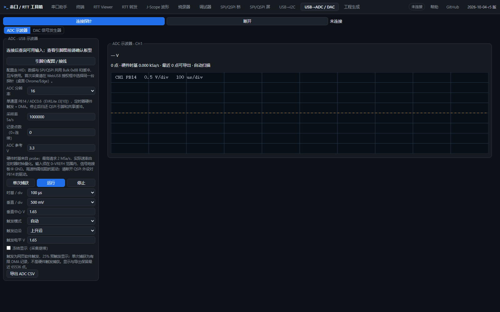
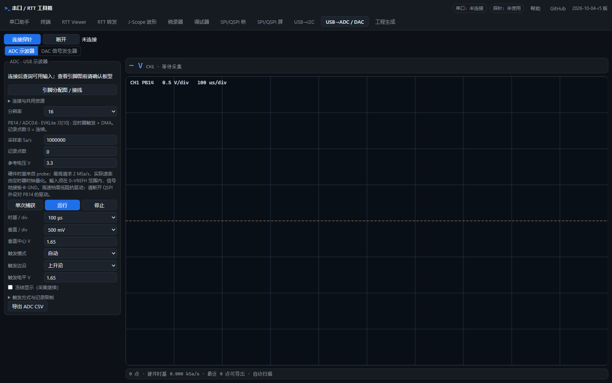

# 2026-10-06 UI 评审与修正记录

评审来源：用户提供的 `ui界面review.txt`。代码基点：`214aa10`，本记录对应其后的 UI 工作区修改。
复核日期：2026-10-06，时区 Asia/Shanghai（UTC+08:00）。页面回归完成于 15:24–15:35；布局截图生成于 15:35:14。

本轮采纳了评审列出的 11 项可见问题，以及字号、对齐、日志、ADC 工作区和操作密度方面的建议。
导航和烧录进度的建议经过审核后采用不同处理，理由见下文。

## 1. 逐项审核结果

| 编号 | 评审问题 | 修正与判据 |
| --- | --- | --- |
| 01 | HTML、提示和状态文字露出 Markdown 星号 | 清理面向用户的 `**` 强调标记；保留源码注释、生成文件及数学运算里的合法星号。 |
| 02 | 烧录基地址截断 | 地址输入使用等宽字体并留足宽度；两种窗口宽度下 `0x08000000` 都能完整显示。 |
| 03 | 烧录日志误用串口占位文字 | 改为烧录过程提示，与串口接收区区分。 |
| 04 | SPI 模式、CS 策略、引脚下拉文字截断 | 选项显示简短的模式/引脚/策略名称，完整说明保留在提示中；协议值不变。 |
| 05 | ADC 画布字体与其它页面不同 | 采用全站等宽字体栈；画布随工作区尺寸和设备像素比更新。 |
| 06 | ADC 标签折成多行 | 使用统一的 88 px 标签列，缩短标签，把连续采集等补充含义放在提示中。 |
| 07 | 顶栏连接状态有歧义 | 分成“串口”和“探针”；探针标签反映实体连接、切换中和释放失败。审核发现旧标签由串口助手、RTT 转发和 RTT Viewer 多处写入，原评审“只有 serial 在写”并不完整；已集中管理。 |
| 08 | SPI 清空日志按钮铺满整行 | SPI、屏、I2C 共用日志标题行，右侧排列复制、保存、清空。 |
| 09 | 中止/停止按钮跨在卡片边框上 | SPI、屏、I2C 的页签、状态、停止动作移入卡片内部的统一工具栏；工程生成页也采用这一结构。 |
| 10 | I2C 未连接显示绿色 | 未连接使用普通状态色，连接成功才用绿色；警告、错误分别显示。 |
| 11 | Scope 空图例和角落提示 | 无通道时隐藏图例容器；无数据时在画布中央显示操作提示。 |

## 2. 采纳的整体改进

- 字号统一为 12 / 13 / 14 / 16 / 20，正文和普通控件 13 px；补充中文字体栈。数字统计、地址和十六进制内容使用等宽字体与等宽数字。
- 圆角使用 4 / 6 / 10 三个 token；状态胶囊、图例小点和拖动手柄保留自身的形状。重复的标签列、间距、零边距样式改用公共类。`index.html` 行内样式从 106 处减少为 26 处，剩余主要是表格列宽和初始隐藏状态。
- 顶栏固定为“品牌与状态”和“工具导航”两行。窄窗口导航横向滚动，全部 12 个工具仍可直接进入。
- ADC/DAC 保留共享会话和两个子标签，连接操作变紧凑；ADC 波形吃满右侧剩余高度，上方显示等宽读数，下方显示采样统计。画布尺寸由 ResizeObserver 缓存，采集绘制不逐帧读取布局。
- 禁用的主按钮改灰；擦写、中止等动作使用红色描边；“套用推荐值”降为普通按钮。独立连接、运行、输出任务保留各自的主动作。
- Scope 读计划、SPI 辅助脚限制、I2C 详细排障、ADC 触发与记录说明默认折叠。供电、上拉、电压范围、共脚等接线约束仍可直接看到。
- 总线日志统一标题和工具，使用页面背景色；串口数据、终端、调试命令行和代码预览保留适合其用途的背景。
- 串口快捷发送默认显示已填内容的行，按需添加，保留 5 个固定编号及 Alt+1～5 对应关系。
- RTT Viewer 的底部统计分成链路、缓冲两组；Scope 缩放动作组成一组分段按钮；调试器命令行提示缩短。
- SPI 命令表默认 3 行，按需增加至 24 行；增加行保留已有节点、内容、结果和发送顺序，示例占位文字只出现在首行。
- 屏的 18 个图案按纯色、对比、测试图分组，纯色按钮带色块。
- I2C 扫描增加 8×16 地址图，ACK 高亮且可点击选用；保留地址不可选，原器件提示表和寄存器联动继续保留。

探针顶栏只查看已有的本地会话与资源状态，没有增加 HID/USB 状态查询；模拟目标不会被显示成实体探针连接。

## 3. 未采纳或保留的建议

| 建议 | 审核结论 |
| --- | --- |
| 把 12 个工具改成两级导航或图标侧栏 | 暂不采纳。现有任务经常在烧录、调试、RTT、Scope、总线之间切换，直接入口更合适。通过独立导航行解决 1280 宽度下的挤压问题。 |
| 烧录器增加擦→写→校验三段进度卡 | 本轮不实施。不同烧录通路的进度回调粒度不同，本地桥部分操作仅返回最终结果；需要先统一真实阶段事件，才能可靠显示三段进度。保留现有真实进度、结果和日志。 |
| 严格限制每页一个蓝色按钮 | 部分采纳。配置与推荐值降低强调程度，禁用态变灰；连接、运行和独立输出各有明确动作，不强行合并。 |
| 所有说明默认收起、所有空状态都附连接按钮 | 部分采纳。折叠长篇解释，保留接线约束；已有连接入口的工作区采用提示，避免增加重复入口。 |
| 一次清除全部行内样式 | 部分采纳。公共视觉规则已迁移，表格各列的语义宽度继续由对应表定义。 |

## 4. 回归结果与时间

环境：Windows、Chrome 153、9333 CDP 测试浏览器；本地无缓存服务 `http://127.0.0.1:8901/index.html`。
页面测试使用内置演示串口和模拟目标；截图来自独立测试配置，不读取用户正常浏览器的设置。

| 测试入口 | 通过 / 失败 | 本地完成时间 |
| --- | --- | --- |
| `make test-ui` | 24 / 0 | 15:34:10 |
| `make test-spi-page`：SPI 桥 | 168 / 0 | 15:24:51 |
| `make test-spi-page`：SPI 屏 | 179 / 0 | 15:25:31 |
| `make test-i2c-page` | 145 / 0 | 15:28:40 |
| `make test-dbg-page` | 143 / 0 | 15:26:44 |
| `make test-gen-page` | 81 / 0 | 15:34:38 |
| `make test-scope-page` | 95 / 0 | 15:34:28 |
| `make test-scope-render` | 14 / 0 | 15:34:38 |
| 新增 `make test-ui-layout` | 54 / 0 | 15:35:14 |
| **页面、渲染、布局合计** | **903 / 0** | |
| `make test-probe test-analog` | 全部通过 | 15:34:15 |
| `make check` | 266 个模块语法、已有 Markdown 检查通过；新增本记录另行显式检查 | 15:38:12 |

布局检查覆盖 1600×1000 和 1280×1000 下全部 12 页，生成 24 张截图：页面及侧栏横向溢出均为 0，侧栏标签可读，停止动作位于卡片内，基地址完整显示，ADC 画布随尺寸更新。原始判据见 [layout.json](2026-10-06-ui-review/layout.json)。页面回归还覆盖串口发送、采样与触发、导出、调试、总线命令和工程生成等原有行为。

本轮新增的检查包括快捷行展开后的编号与内容保持、SPI 增加行时的节点与内容保持、I2C ACK 选用及保留地址、公共日志工具、探针状态。探针状态离线检查覆盖未使用、普通串口、模拟目标、单功能、共享连接、切换中和释放失败。

Scope 套件中修正了旧测试的异步准备：等待 `setMock()` 完成后再开始采样。另一个旧断言期待 HID 失败后自动重发，与现有[探针资源架构](../probe-resource-architecture.md#跨页面与-hid)约定冲突；现验证“报错且不自动重发/重新认领”，没有改动该传输约定来迁就测试。

复现入口（仓库根目录）：

```powershell
make check
make test-probe test-analog
make test-ui
make test-spi-page test-i2c-page test-dbg-page test-gen-page test-scope-page
make test-scope-render test-ui-layout
```

本次为避开旧页面缓存，测试时设置了 `$env:APP='http://127.0.0.1:8901/index.html'`，并运行 `node tools/dev/serve-nocache.mjs 8901`。布局套件自身也禁用 HTTP 缓存。
原始运行输出与全部 24 张截图位于 `tmp/ui-review/`，属于可再生成的临时产物；下方代表截图已保存进文档目录。

本轮没有进行新的真机吞吐或电气精度测试，903 项结果不能替代 ADC 1/2 MSa/s、RTT 速度或各板卡 full flow 的真机验收。既有真机结果见[硬件测试记录](2026-10-05-hardware-test-results.md)。

## 5. 截图

ADC 的工作区变化（1600×1000；未开始采集）：

| 修改前 | 修改后 |
| --- | --- |
|  |  |

以下为 1280×1000 的默认页面状态，方便逐页复核。测试配置中的示例和表单值不代表当前实体硬件连接。

| 页面 | 截图 | 页面 | 截图 |
| --- | --- | --- | --- |
| 串口助手 | [查看](2026-10-06-ui-review/serial.png) | 终端 | [查看](2026-10-06-ui-review/terminal.png) |
| RTT Viewer | [查看](2026-10-06-ui-review/rtt.png) | RTT 转发 | [查看](2026-10-06-ui-review/rttcdc.png) |
| J-Scope | [查看](2026-10-06-ui-review/scope.png) | 烧录器 | [查看](2026-10-06-ui-review/flash.png) |
| 调试器 | [查看](2026-10-06-ui-review/dbg.png) | SPI 桥 | [查看](2026-10-06-ui-review/spi.png) |
| SPI 屏 | [查看](2026-10-06-ui-review/panel.png) | I2C | [查看](2026-10-06-ui-review/i2c.png) |
| ADC/DAC | [查看](2026-10-06-ui-review/analog.png) | 工程生成 | [查看](2026-10-06-ui-review/gen.png) |
